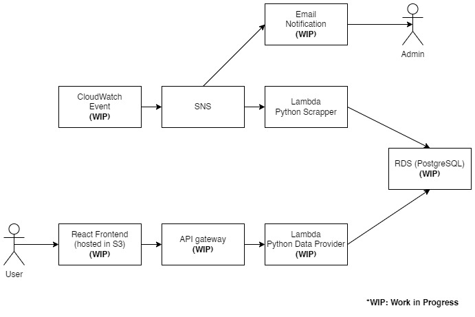

# Melbourne House Price 

## Table of Contents

1. [Overview](#overview)
2. [Architecture](#architecture)
3. [Deployment](#deployment)
4. [Data](#data)
5. [Further Works](#further-works)


## Overview <a name="overview"></a>

DISCLAIMER: This project make use of a web scrapper which might be a violation of ToS to some websites. This project is for educational purpose only!

The purpose of this project is to collect Melbourne house price data from auction results which are published weekly by [Domain](https://www.domain.com.au/auction-results/melbourne).

The project aims to collect the auction result and be able to answer questions such as:
* What is the median price of suburb X?
* What is the median price of a house with 2 bedrooms?

This project makes use of:
1. Python web scrapper (requests & BeautifulSoup) to collect data
2. Python pandas to clean, process and provide data
2. AWS Lambda
3. AWS RDS
4. AWS CloudWatch Event
5. AWS SNS
6. AWS S3
7. AWS API Gateway
8. AWS CloudFormation

## Architecture <a name="architecture"></a>



The flow of the data collection starts from `CloudWatch Event` which is triggered weekly to send an event to SNS which will then trigger a `Python Lambda function` to scrap and collect auction data, do some data cleaning and store it in `RDS Postgres database`.

User can then view the data by making a request to S3 to open a React frontend which will display the latest auction data.

For easier deployment, a CloudFormation file is used to deploy the required resources in AWS

### Project Structure

Scrapper function is available inside the `scrapper` folder, currently this needs to be deployed to S3 bucket manually

The CloudFormation file is provided in `infra.yaml`

## Data <a name="data"></a>

Data extracted are:
* suburb
* address
* sold price
* sold type (auction/private)
* number of bedrooms
* number of bathrooms
* number of carparks
* land area
* sold database
* zip code
* state

## Deployment <a name="deployment"></a>

**1. Create an S3 bucket to hold the Lambda function zip**

Create an S3 bucket which will hold the Python source code and upload the zipped function into this bucket (for the purpose of this manual, we will call this `lambda-bucket`)

for convenience, the `function.zip` has been provided in the repo

to generate another `function.zip` (in case of code update / dependencies change)

first create the virtual env

```
cd scrapper
python -m venv env
.\env\Scripts\activate
pip install -r requirements.txt
```

then prepare the zip file containing all the dependencies

```
cd env/Lib/site-packages
zip -r9 ${OLDPWD}/function.zip .
cd $OLDPWD
zip -g function.zip app.py
zip -g function.zip helpers.py
```

deploy this `function.zip` into S3

```
aws s3 cp function.zip s3://lambda-bucket
```

**2. Create the resource stack using the CloudFormation file**

Assuming that the AWS CLI has been configured and has the correct permissions, edit the `infra.yaml` and update the S3 bucket containing the scrapper lambda zip file

```
Code:
        S3Bucket: projectlambdazipbucket
        S3Key: function.zip
```

go back to the root folder and run the command

```
aws cloudformation create-stack --stack-name "scrapper-project" --template-body file://./infra.yaml --capabilities CAPABILITY_NAMED_IAM
```

this will create the required resources to run the project

## Further works <a name="further-works"></a>

There are a number of items that are still WIP (work in progress), this will be done to build the complete project

A CI/CD pipeline will be required in order to further improve the ease of deployment, especially with zipping the Lambda functions and copy it to S3 bucket before launching CloudFormation template